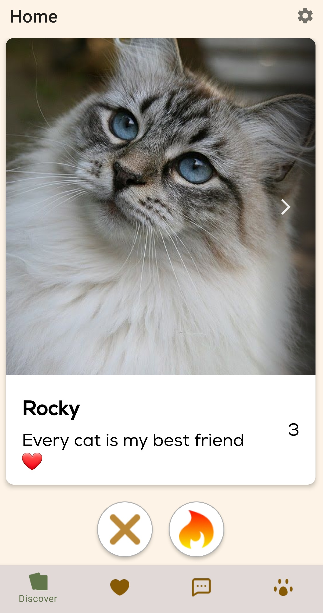

# 🔥 HotPet - Animal Dating iOS App

**HotPet** is an iOS app designed to bring together pet owners and their furry friends in a fun and interactive dating environment.
This app allows users to create profiles for their pets, browse other pet profiles, and connect with like-minded pet owners in their area.
Whether you're looking for playdates, friendship, or even love for your furry companion, HotPet is the perfect platform to make it happen.

## 📑 Features

• **User registration and authentication** :  
Users can create an account, log in, and manage their profile

 

• **Profile creation and management** :  
Users can create profiles for their pets, including uploading pictures and providing information about their pets' breed, age, and interests.

 
  

• **Matching** :  
HotPet uses a matching algorithm to suggest potential matches based on pet compatibility and user preferences.

 

• **Filtering** :  
Users can filter the displayed pets on the discover by age, category and distance.

 

• **Chat** :  
Users can initiate conversations with other pet owners through a built-in messaging system to arrange playdates or discuss common interests.

 

## 📑 Technologies Used

• iOS development using Swift and Xcode  
• Backend development using Node.js  
• Database management using MongoDB  
• Integration of Google Sign-In for user authentication  
• Geolocation services for proximity-based search and event recommendations

## ⤵️ Installation

1. Clone the repository to your local machine.
2. Open the project in Xcode.
3. Set up the necessary Firebase project and configure the Firebase SDK by following the provided instructions.
4. Build and run the app on a simulator or physical device running iOS 14.0 or later.
5. Explore the app and enjoy connecting with other pet owners!

## 🤝 Contributing

We welcome contributions to improve HotPet! If you'd like to contribute, please follow these steps:

1. Fork the repository.
2. Create a new branch for your feature or bug fix.
3. Make your changes and ensure they are properly tested.
4. Commit and push your changes to your forked repository.
5. Open a pull request, describing your changes and the problem they solve.

## 📜 License

HotPet is licensed under the MIT License.

